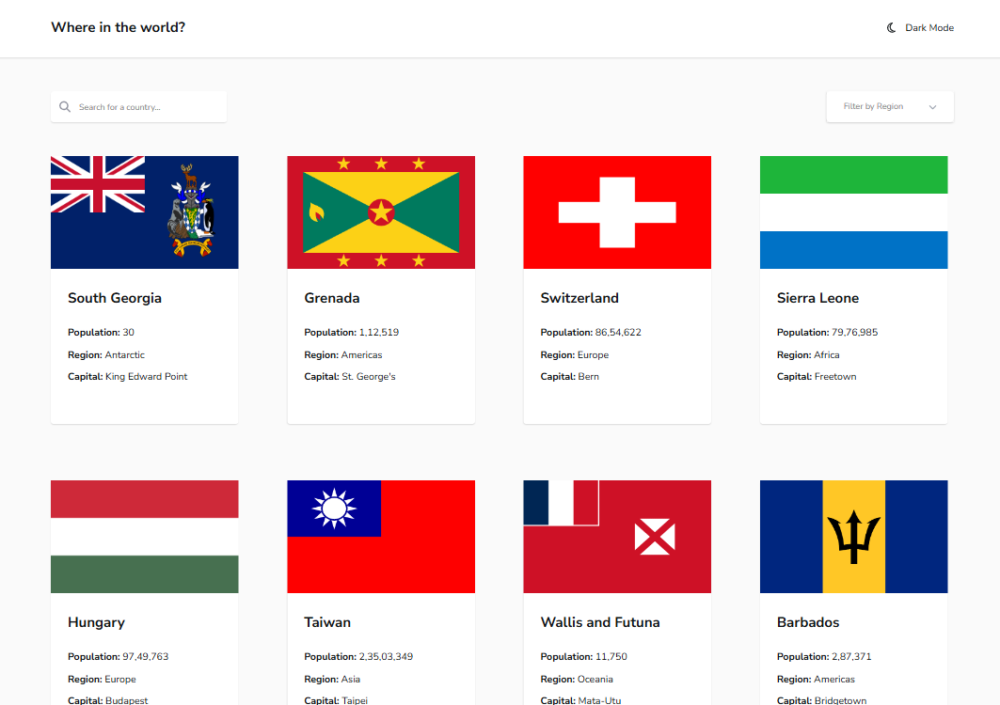
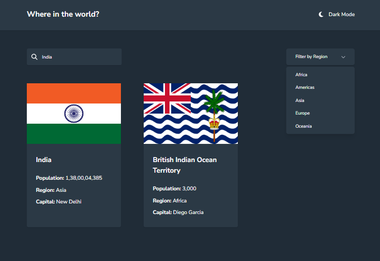
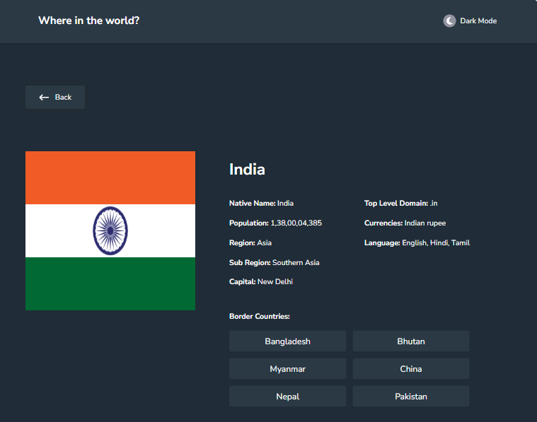

# REST Countries API with color theme switcher

This is a solution to the [REST Countries API with color theme switcher challenge on Frontend Mentor](https://www.frontendmentor.io/challenges/rest-countries-api-with-color-theme-switcher-5cacc469fec04111f7b848ca). Frontend Mentor challenges help you improve your coding skills by building realistic projects. 

## Table of contents

- [Overview](#overview)
  - [The challenge](#the-challenge)
  - [Screenshot](#screenshot)
  - [Links](#links)
- [My process](#my-process)
  - [Built with](#built-with)
  - [What I learned](#what-i-learned)
  - [Continued development](#continued-development)
  - [Useful resources](#useful-resources)
- [Author](#author)
- [Acknowledgments](#acknowledgments)

## Overview

### The challenge

Users should be able to:

- See all countries from the API on the homepage
- Search for a country using an `input` field
- Filter countries by region
- Click on a country to see more detailed information on a separate page
- Click through to the border countries on the detail page
- Toggle the color scheme between light and dark mode

This project is responsive at screens from Desktop (1440px) to Mobile S (320px).

### Screenshot

**Snapshot at screen width 1440px >** `Home page` with some country cards in dark theme.

**Snapshot at screen width 1040px >** Using search bar, find the India card, it shows 2 countries which has "india" in their name. You can also see dropdown menu. Theme is light.

**Snapshot at screen width 1040px >** `Detail page` of India in the light theme. You can see basic information about India like population, region, capital, currency and more.

Also, you can see neighbor countries name inside buttons. If you click them, you can see detail page on clicked country.

### Links

- Live Site URL: [Live Link](https://b9-country-info.vercel.app/)

- Solution URL: [Source Code](https://github.com/SoniBasant/b9-country-info) 

If you want to pull the project code, you can do it from above source code.

After that, First, run the development server by typing >

`npm run dev`

You will see a link in localhost, like "http:// localhost:3000", open it with your browser to see the result.

## My process

As I don't have `figma` file of design. So the dimensions and spacing is based on my judgement. My project may/ may not be same as the design.

### Built with

- **React** - JS library
- **create-next-app** - For Project development
- **Next.js** - React framework
- **Redux JS** - State Management
- **Redux Thunk** - Middleware for side-effect (API)
- **Axios** - Promise Based HTTP client
- **Tailwind CSS** - CSS framework for Utility Based classes
- **headless UI** - For Dropdown Menu
- **Fontawesome Icon** - For Icons
- Mobile-first workflow
- **Vercel** - For deployment

### What I learned

This is my first `NextJS` project. Not just NextJS, I work with some other tech stack first time.

Below is the list of my **first-time** tech stack-

- NextJS
- App Router
- Redux JS
- Redux Thunk
- Axios

I used a component collection of UI, `headless UI`. I used it for dropdown menu for region filtering.

Also,

I used `object based fontawesome icons` which provide `individual import` of icon. By using object based method, I import only required icons not the whole library which reduces bundle size.

### Continued development

As this is big project, there is a scope for further development-

- Home page is taking much time to load. Need to minimise it by some optimization.
- After search, there should be an option to go back to home page.
- Home page render all country card at once. Need to reduce it to save initial rendering load.
- Fine tune spacing (padding, margin, height, width).
- Different optimization techniques > Memoization, caching, fuse.js etc.

Also, your feedback and suggestions are welcome. 🤗 🙏🏻

### Useful resources

- [REST Country API](https://restcountries.com/) - REST API for all countries
- [React](https://reactjs.org/) - JS library
- [Next.js](https://nextjs.org/) - React framework
- [Redux JS](https://redux.js.org/) - State Management
- [Redux Thunk](https://redux.js.org/usage/writing-logic-thunks) - Middleware for side-effect (API)
- [Axios](https://axios-http.com/docs/intro) - Promise Based HTTP client
- [Tailwind CSS](https://tailwindcss.com/) - CSS framework for Utility Based classes
- [headless UI](https://headlessui.com/) - For Dropdown Menu
- [Fontawesome Icon](https://fontawesome.com/) - For Icons
- [Vercel Platform](https://vercel.com/new?utm_medium=default-template&filter=next.js&utm_source=create-next-app&utm_campaign=create-next-app-readme) - For project deployment
- ChatGPT - For all my queries and guidance

## Author

Basant Soni 👨‍💻

- GitHub - [@SoniBasant](https://github.com/SoniBasant)

- Frontend Mentor - [@SoniBasant](https://www.frontendmentor.io/profile/SoniBasant)
- CodePen - [@SoniBasant](https://codepen.io/sonibasant)
- Hashnode - [@SoniBasant](https://sonibasant.hashnode.dev/)

## Acknowledgments

Appreciation for the person who is managing REST Country API. Without that API, this project is not possible. 🙏🏻🙏🏻

This is the [`Link`](https://restcountries.com/) to REST Country API.